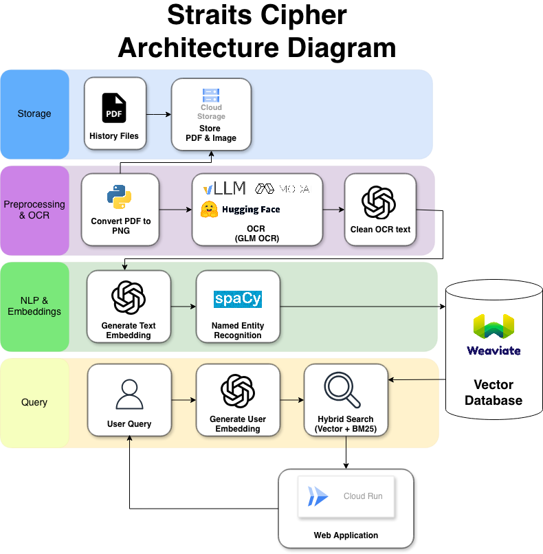

# Backend

OCR-to-RAG backend pipeline for processing historical archive PDFs into searchable vectors and document summaries.

## Key Features

- Multi-stage document pipeline: rename -> PDF-to-image preprocessing -> OCR extraction -> chunk embedding -> document summary embedding.
- Document-level summary embedding flow for generating a high-level knowledge map of each document.
- Weaviate integration for vector storage (page-level and summary-level collections).
- Modal-powered vLLM OCR server support for image-to-text extraction.
- Simple progress tracking with `*_processed.txt` logs for resumable runs.

## What The Pipeline Does

The pipeline transforms raw archive PDFs into Weaviate vectors and document summaries:

1. PDFs are placed in `backend/data/*.pdf`.
2. Filenames are normalized by `0_rename.py` to `Title__CO123:456:789.pdf`.
3. `1_convert_to_png.py` converts each PDF page to PNG, uploads pages to GCS (`imgs/...`), and stores page data URLs in `preprocessed/*.pdf.pkl`.
4. `2_OCR.py` reads `preprocessed/*.pkl` and writes OCR text files to `OCRd/*.txt` (page-delimited format).
5. `3_embed.py` reads `OCRd/*.txt`, generates embeddings + NER metadata, and inserts records into Weaviate.
6. `5_doc_summary_embed.py` optionally creates per-document summaries + embeddings.

Current code note: the actual OCR execution/write block in `scripts/pipeline/2_OCR.py` is currently commented out. Running it as-is will enumerate files but will not write `OCRd/*.txt` until that block is uncommented.



## Folder Structure

```text
backend/
├── data/                      # Input PDFs (ingestion source)
├── preprocessed/              # Intermediate per-PDF pickle files from step 1
├── scripts/
│   ├── pipeline/
│   │   ├── 0_rename.py
│   │   ├── 1_convert_to_png.py
│   │   ├── 2_OCR.py
│   │   ├── 3_embed.py
│   │   ├── 4_ner.py
│   │   └── 5_doc_summary_embed.py
│   ├── infra/
│   │   ├── setup_weaviate.py
│   │   └── vllm_server.py
│   └── dev/
│       ├── test_ocr.py
│       └── test_gcp_storage.py
├── OCRd/                      # OCR output text files
├── summary_outputs/           # Per-document summary JSON outputs
├── logs/                      # Runtime logs (e.g. summary pipeline logs)
├── img_processed.txt          # Process tracking for PDF->image preprocessing
├── ocr_processed.txt          # Process tracking for OCR stage
├── embed_processed.txt        # Process tracking for embedding stage
├── doc_summary_processed.txt  # Process tracking for summary stage
├── pyproject.toml
└── uv.lock
```

## Getting Started

### 1) Prerequisites

- Python `>=3.12`
- `uv` installed
- System dependencies for `pdf2image` (Poppler)
- Access credentials configured in `.env` (as required by scripts), for example:
  - `OPENAI_API_KEY`
  - `WEAVIATE_URL`
  - `WEAVIATE_API_KEY`
  - GCP credentials for `google-cloud-storage`

### 2) Install dependencies

```bash
cd ai-history-hackathon/backend
uv sync
```

### 3) Bootstrap first-time local run

Create expected folders and progress files before the first run:

```bash
cd ai-history-hackathon/backend
mkdir -p data preprocessed OCRd logs summary_outputs
touch img_processed.txt ocr_processed.txt embed_processed.txt doc_summary_processed.txt
```

### 4) Run scripts from `backend/` directory

Run from `backend/` folder directly so relative paths resolve correctly (`data/`, `preprocessed/`, `OCRd/`, `*_processed.txt`).

Example:
```bash
cd ai-history-hackathon/backend
python scripts/pipeline/0_rename.py
python scripts/pipeline/1_convert_to_png.py
python scripts/pipeline/2_OCR.py
python scripts/pipeline/3_embed.py
python scripts/pipeline/5_doc_summary_embed.py
```

### 5) Prepare ingestion inputs

1. Put source PDFs into `backend/data/`.
2. (Optional) Run rename normalization:
   - `python scripts/pipeline/0_rename.py`

```bash
cd ai-history-hackathon/backend

# One-time setup for page-level collection.
# Note: this may fail if collection already exists.
python scripts/infra/setup_weaviate.py

# OCR server mode A (use currently hardcoded hosted endpoint in 2_OCR.py):
# - no extra command needed here.
#
# OCR server mode B (self-hosted on your own Modal deployment):
# - deploy/run scripts/infra/vllm_server.py
# - then update ENDPOINT and api_key constants inside scripts/pipeline/2_OCR.py
# modal run scripts/infra/vllm_server.py

# Main pipeline
python scripts/pipeline/1_convert_to_png.py

# IMPORTANT:
# scripts/pipeline/2_OCR.py currently has its OCR run section commented out.
# Uncomment that block first, then run:
python scripts/pipeline/2_OCR.py

# Run after OCR text files exist in OCRd/
python scripts/pipeline/3_embed.py

# Optional helpers
python scripts/pipeline/4_ner.py
python scripts/pipeline/5_doc_summary_embed.py
```

For script-specific notes, see `scripts/README.md`.
